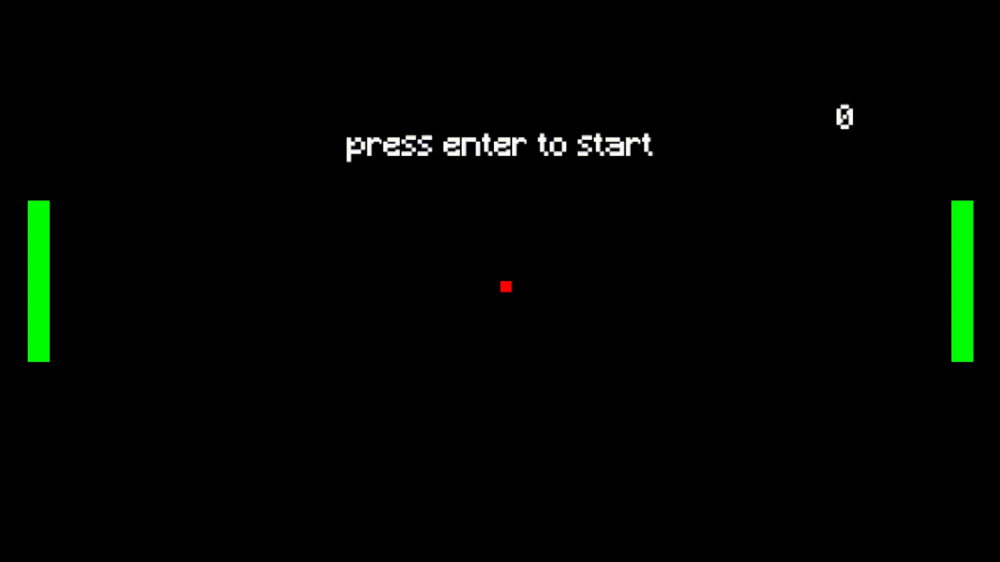

# Pong Game

## Description

A simple Pong game built with Pygame. The game features two paddles and a ball. The objective is to score points by getting the ball past the opponent's paddle.

## Gameplay



## How to downloud and play

- Downloud from the [link](https://github.com/codemanbh/pong)
- After downlouding, Just click on `pong.exe` to start the game

## Controls

- Start the gameplay `Enter button`
- Player (Left Paddle): `W` (up), `S` (down)
- Play again `Enter button`

## Author

- [Ahmed Yusuf Khamdan](https://github.com/codemanbh)

## Requirements

- Python 3.x
- Pygame

## Installation

1. Clone the repository:
   ```sh
   git clone https://github.com/codemanbh/pong.git
   ```
2. Navigate to the project directory:
   ```sh
   cd pong
   ```
3. Install dependencies:
   ```sh
    pip install -r requirements.txt
   ```

## Project Structure

```
pong/
├───assets
│   └───fonts
│     └───Mincraft.ttf
├───components
│   │───ball.py
│   │───line.py
│   │───player.py
│   └───screen.py
├───main.pyw
│ 
├───demo
│   └───gameplay.gif
│
├───.gitignore
│
└───README.md
```

## License

This project is licensed under the MIT License.


